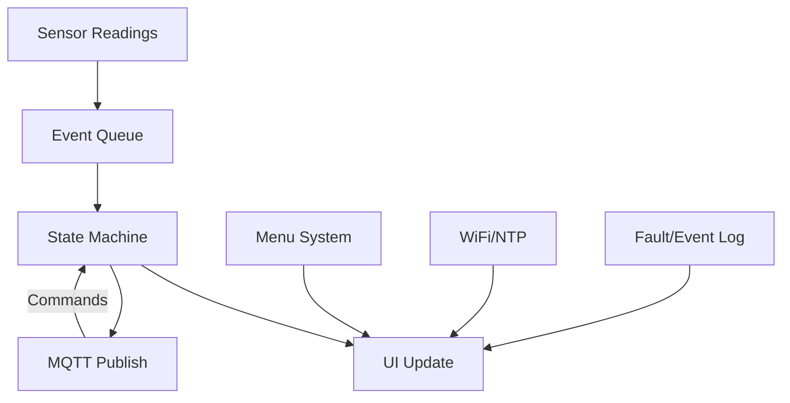

# Next Gen Water Tank Controller
---
Outline
---
- [Introduction](#a-smart-water-tank-controller-that)
- [Technology](#technology)
- [System Overview](#system-overview)
  - [Software Features](#software-features)
  - [Safety System](#safety-system)
  - [Fail-Safe Design](#fail-safe-design)
  - [Operation Modes](#operation-modes)
- [User Interface](#user-interface)
  - [NeoPixel Logic](#neopixel-logic)
  - [Buttons Logic](#buttons-logic)
  - [Buzzer Logic](#buzzer-logic)
  - [OLED UI Logic](#oled-ui-logic)
- [Firmware Architecture Overview](#firmware-architecture-overview)
  - [Core Layers](#core-layers)
  - [System Flow Diagram](#system-flow-diagram)
  - [State Machine](#state-machine)
  - [Dual-Core Architecture (ESP32)](#dual-core-architecture-esp32)
- [Actuation Strategy](#actuation-strategy)
- [Power Strategy](#power-strategy)
- [Hardware](#hardware)
  - [Hardware List](#hardware-list)
  - [Hardware & Wiring Details](#hardware--wiring-details)
  - [Hardware & Wiring Block Diagram](#hardware--wiring-block-diagram)
  - [Power Distribution](#power-distribution)
  - [Other connections](#other-connections)
  - [Pinout (ESP32 WROOM-32)](#pinout-esp32-wroom-32)
- [MQTT Command Reference](#mqtt-command-reference)
- [Getting Started](#getting-started)
- [Troubleshooting](#troubleshooting)
- [Safety Notes](#safety-notes)
- [Future Scope](#future-scope)
- [File Structure](#file-structure)
- [License]
- [Author]

---
# A Smart water tank controller that
-   Monitors tank level (Float Sensors + Pressure Sensor)
-   Validates pump operation (flow + current)
-   Controls pump via  **mechanical actuation (solenoids)**
-   Provides  **local UI + remote MQTT control**
-   Ensures  **multi-layer safety + fail-safe operation**
-   SMART

---
# Technology
### Controller

-   ESP32 (NodeMCU form factor)

### Brain
-   Free RTOS

### Sensors

-   4 × Float switches → Level detection (25/50/75/100%)
-   YF-S201 flow sensor  → Flow validation + consumption
-   CT Clamp SCT-013  → Pump current detection
-   Analog Pressure Sensor
-   2 × Micro-switches → Solenoid press feedback
-   DHT22  → Ambient monitoring (near controller)

### Actuation

-   2 × 12V solenoids (push ON / push OFF)
-   2 × relay modules (control solenoids)

### UI

-   SSD1306 OLED (I2C)
-   10 × NeoPixel LEDs
-   Buzzer
-   4 × push buttons

### Power

-   12V 10A SMPS → Master Power + Solenoids
-   LM2596 Buck Converters (2) → 

### Wiring
-   CAT6 cable (~10m) → tank sensors

### Protection

-   10k pull-ups on all float lines
-   220Ω series resistors (long lines)
-   100nF capacitor on flow signal
-   Common ground across system

---
# System Overview
## Software Features

-  **WiFi & NTP**: Connects to WiFi and syncs time via NTP, displays current time on UI
-  **MQTT Support**: Publishes sensor data, receives commands for remote control and configuration
-  **Fault/Event Logging**: Tracks sensor faults, implausible readings, and system events
-  **Settings Persistence**: User settings stored in non-volatile memory
-  **Low Power/Sleep Mode**: Toggle sleep mode from menu
-  **Event-driven OLED UI**: Updates only on events or once per minute 
-  **Menu System**: On-device menu for mode selection, settings, uptime, fault log, and more
-  **OTA Ready**: Partition reserved for future OTA updates
---

## Safety System
- Dry Run Detection
	-   Pump ON
	-   No flow within 5–10 sec → STOP

- Electrical Failure
	-   Pump ON
	-   No current → STOP

- Max Runtime
	-   Limit (e.g., 30 min)

- Retry Logic
	-   Retry 2–3 times → then ERROR state

---
### Fail-Safe Design
- If ESP fails:
	- Manual starter still works
- If sensors fail:
	- System enters safe ERROR mode
- If WiFi fails:
	- Local control unaffected

---
### Operation Modes

AUTO
MANUAL
TIMER (5/10 min configurable)
ERROR
OVERRIDE (temporary bypass)

---
# User Interface

### NeoPixel Logic
**Level Display**

```
| Level   | LEDs                       |
| ------- | -------------------------- |
| 0–25%   | Bottom 1 → Red (Full Glow) |
| 25–50%  | 3   → Orange 		-	   |
| 50–75%  | 6   → Yello         -      |
| 75–100% | 8   → Blue          -      |
| 100%    | 10  → Green     (dimming)  |
```
**Pump ON Animation**
When filling:
-   Active range LEDs  **blink sequence**:
1 ON → 2 ON → OFF → repeat

Example:

-   25–50% → LEDs 3–4 animate
-   50–75% → LEDs 5–6 animate

**Overrides**

```
| State  | LED Behavior     	|
| ------ | ---------------------|
| Error  | All red blinking 	|
| Timer  | Last Yellow pulsing  |
| Manual | Last Purple          |
| Idle   | Last Blue            |
```
---
### Buttons Logic
-   Debounce (50ms) filters noise
-   Hold guard (300ms) prevents accidental re-triggers
-   If held ≥ 1500ms →  PRESS_LONG  event is emitted immediately (while still held)
-   On release, if long already fired → no short event emitted
-   On release, if long NOT fired →  PRESS_SHORT  event is emitted

**Buttons mapping while on homescreen**
-   **B1**  (short) = stop buzzer
	- (long) = Toggles AUTO/MANUAL mode:
		-   If in MANUAL_ON, switches to AUTO and stops pump.
		-   If in IDLE, switches to MANUAL and starts pump (unless in monitor-only mode).
-   **B2**  (short) = If in IDLE, starts Timer 1 (manual ON for timer1Sec duration).
-   **B3**  (short) = If in IDLE, starts Timer 2 (manual ON for timer2Sec duration).
	- (long) = HARD STOP/reset. If pump is running or starting, transitions to STOPPING. If in FAULT_LATCHED or ERROR, clears latched faults.
-   **B4**  (short) = open menu
	- (long) = Toggles SLEEP mode (enters SLEEP or returns to IDLE).

**Buttons mapping in while inside menu**
-   **B3**  (short) = move forward/down in list
-   **B2**  (short) = move backward/up in list
-   **B4**  (short) = select/activate
-   **B1**  (short) = back/close

**Summary:**
-   Menu navigation and editing are only active when the menu is open.
-   All other button events on the home screen are mapped to state machine actions for mode switching, timers, pump control, and sleep.
---

### Buzzer Logic
	- Tank Full  -   Beep for 2–3 sec → stop-
	- Error -   Beep every 1 sec continuously
	- B1 -   Silence buzzer only
---
### OLED UI Logic

-   **Event-Driven Updates:**  
    The UI only redraws when an event occurs (e.g., state change, menu navigation, sensor update) or every 5 seconds as a fallback. This is managed by the  ui_requestUpdate()  function and a  s_uiDirty  flag.
    
-   **Popup Overlay:**  
    Temporary popups (e.g., "Mode: AUTO", "Defaults OK") are shown using  ui_showPopup(). While a popup is active, it overlays all other UI content.
    
-   **Menu & Value Editor:**
    
    -   If the menu is open (menu_isOpen()), the UI displays a scrollable list of menu items.
    -   If a value editor is active (menu_isEditing()), it shows the current setting being edited, with increment/decrement/confirm/cancel hints.
-   **Dashboard (Default/Home Screen):**  
    When no popup or menu is active, the UI displays:
    
    -   **Row 1:**  Water level (%) | State (4 chars) | WiFi status icon
    -   **Row 2:**  Pressure (MPa) | Mode (4 chars)
    -   **Row 3:**  Flow (L/min) | Pump current (mV) | Pump ON/OFF
    -   **Row 4:**  Temperature (°C) and Humidity (%)
    -   **Row 5:**  Day and time (from NTP) or uptime if not synced
-   **Rendering Details:**
    
    -   Uses Adafruit SSD1306 library.
    -   Font size and layout are chosen for maximum readability.
    -   WiFi status is shown as an icon in the top right.
    -   All sensor values are live and update immediately on change.

**Below is the list of Menu Items**
```
  "Mode: AUTO"
 >"Mode: MANUAL"
  "Mode: TIMER"
  "Toggle SLEEP"
  "MIN Water Level"
  "MAX Water Level"
  "Pressure 0%"
  "Pressure 100%"
  "Pulse ON (ms)"
  "Pulse OFF (ms)"
  "Dry-Run (s)"
  "Max Runtime (m)"
  "Timer 1 (s)"
  "Timer 2 (s)"
  "CT Thresh (A)"
  "Show Uptime"
  "Clear Faults"
  "Show Faults"
  "Reset Defaults"
  "Reboot"
  "Exit"
```
---
# Firmware Architecture Overview
  
Event-Driven + State Machine + Multi-Task (FreeRTOS)

### Core Layers
```
[ Hardware Layer ]
   ↓
[ Drivers (GPIO, I2C, ADC, Interrupts) ]
   ↓
[ Services (Sensors, MQTT, UI, Timer) ]
   ↓
[ State Machine (Decision Engine) ]
   ↓
[ Actuation Layer (Relays, LEDs, Buzzer) ]
```

### State Machine
#####  States:
IDLE
AUTO_FILLING
MANUAL_ON
TIMER_RUNNING
FULL
ERROR
OVERRIDE
 
---

## System Flow Diagram

  


---

  

## Dual-Core Architecture (ESP32)

  

The ESP32 features two independent CPU cores, which this project leverages for robust, real-time operation:

``` 
| Core 				  | Tasks Handled  					 	                     |

|---------------------|-----------------------------------------------------------|

| Core 1 (App/RTOS)   | Sensor reading, flow ISR, control logic, safety checks    |

| Core 0 (Pro/Comm)   | UI rendering, LED/buzzer effects, MQTT, WiFi, DHT22, menu |

```  

-  **Core 1** is dedicated to real-time, safety-critical tasks (sensor polling, state machine, actuator control) to ensure reliable water management.

-  **Core 0** handles user interface, network communication, and non-critical peripherals, keeping the UI and MQTT responsive without interfering with control logic.

- This separation ensures that time-sensitive operations are never blocked by WiFi, MQTT, or display updates.
---

## Actuation Strategy

- The system uses two opto-isolated relay modules to control ON and OFF solenoid valves for water flow.

- All actuation is performed using short, timed pulses (default 1000 ms, configurable), never continuous holding, to minimize power consumption and extend solenoid life.

- Mutual interlock is enforced in both hardware and firmware: ON and OFF solenoids can never be energized simultaneously.

- Feedback micro-switches on the solenoids confirm successful actuation and provide an extra layer of safety.

- All actuation events are logged, and faults (e.g., stuck valve, implausible state) are detected and reported.

---


## Power Strategy


- The system is powered by a single 12V 8–10A SMPS (Switched-Mode Power Supply), providing reliable power for solenoids, relays, and all logic.

- Two buck converters (LM2596 or similar) step down 12V to 5V:

- One dedicated for the ESP32 and logic circuits (ensuring clean, isolated supply).

- One for relays, LEDs, and other peripherals.

- Solenoids are powered directly from the 12V rail and are only pulsed, never held, to minimize power consumption and heat.

- All power rails are protected with bulk capacitors, TVS diodes, and fuses for stability and safety.

- Star grounding is used at the SMPS terminals to prevent ground loops and noise issues.

---
 
# Hardware 
## Hardware List

- ESP32 Dev Board (WROOM-32)
- SSD1306 OLED (I2C)
- DHT22 temperature/humidity sensor
- YF-S201 flow sensor
- Analog pressure sensor (0.5–4.5V, 1MPa)
- 4x float switches (magnetic)
- CT clamp (SCT-013-000, optional)
- 2x relay modules (opto-isolated)
- 2x solenoids (12V)
- 4x push buttons
- Buzzer
- NeoPixel (WS2812B x8)
- 12V 8–10A SMPS
- 2x LM2596 Buck Converters

---
  

## Hardware & Wiring Details

  
**Solenoids & Relays:**

- Two 12V DC solenoid valves are controlled via opto-isolated relay modules for ON/OFF actuation.

- Relays are driven by the ESP32 through dedicated GPIOs, with opto-isolation protecting the microcontroller from voltage spikes.

  
**Flyback Diodes:**

- Fast-recovery flyback diodes are installed across each solenoid coil and relay coil to suppress voltage spikes (inductive kickback) when switching off, protecting both relays and ESP32.

  
**Power Distribution:**

- All high-current devices (solenoids, relays) are powered directly from the 12V SMPS.

- Logic and low-power peripherals are powered via buck converters stepping down to 5V.

- Bulk capacitors (2200µF on 12V, 1000µF on 5V) are used to stabilize supply rails and absorb surges.

  
**Grounding:**

- Star grounding is implemented at the SMPS terminal: all grounds (logic, relay, solenoid) return to a single point to prevent ground loops and noise.

  
**Fusing & TVS Protection:**

- A 5–8A fuse is placed on the main 12V input for overcurrent protection.

- TVS (transient voltage suppression) diodes are used on the 12V rail to clamp voltage spikes.
 

**Signal Cabling:**

- CAT6 cable is used for remote float and flow sensors, providing robust, noise-resistant connections over distance.

  
 **Feedback & Safety:**

- Micro-switches on solenoids provide feedback to confirm actuation.

- All sensor inputs use pull-up resistors as required by the ESP32 and sensor type.
 

**Relay Interlock:**

- Hardware and firmware ensure that ON and OFF relays can never be energized at the same time, preventing hardware damage.

  

**Optional Additions:**

- Provision for a hardware max-on timer (555/ATtiny) for redundant cutoff.

- Pads for future MCU UPS (battery backup) and pressure sensor upgrades.

 
---

**Tip:** Always double-check wiring before powering up. Use proper gauge wires for high-current paths, and keep logic and power wiring separated to minimize noise.

  
---


## Hardware & Wiring Block Diagram

**Hardware Blocks**

---
     +-------------------+         +-------------------+
     |    12V SMPS       |         |    ESP32 DevKit   |
     |   (8–10A)         |         |                   |
     +-------------------+         +-------------------+
              | 12V                           |
              |                               |
    +-------------------+           +-------------------+
    |   Buck #1 (5V)    |           |   Buck #2 (5V)    |
    |  (Logic Supply)   |           | (Relays/LEDs)     |
    +-------------------+           +-------------------+
              |                               |
              |                               |
     +-------------------+           +-------------------+
     |   ESP32 + OLED    |           |   Relays (ON/OFF) |
     |   Sensors, Logic  |           |   (Opto-isolated) |
     +-------------------+           +-------------------+
              |                               |
              | GPIOs                         | 12V
              |-------------------------------|<------------------+
              |                               |                   |
     +-------------------+           +-------------------+        |
     |   Solenoid ON     |           |   Solenoid OFF    |        |
     +-------------------+           +-------------------+        |
              | 12V                           | 12V               |
              |                               |                   |
     +-------------------+           +-------------------+        |
     |  Flyback Diode    |           |  Flyback Diode    |        |
     +-------------------+           +-------------------+        |
              |                               |                   |
            GND                             GND                 GND
              |                               |                   |
     +------------------------------------------------------------+
     |                       Star Ground                          |
     +------------------------------------------------------------+

---
  
### Power Distribution
```
12V SMPS (8–10A)

├── Buck #1 (LM2596 @5V) ──→ ESP32 + Logic + Sensors (via Vin/5V pin)

├── Buck #2 (LM2596 @5V) ──→ Relays + LEDs

└── Direct ────────────────→ Solenoids (ON/OFF valves, pulsed only)

```   

---

### Other connections

Float/flow sensors via CAT6 cable to ESP32 GPIOs (with pull-ups)

Feedback micro-switches wired to ESP32 GPIOs

TVS diode and fuse on 12V input

Bulk capacitors on 12V and 5V rails

---


### Pinout (ESP32 WROOM-32)

```c++

            ┌──────────────┐
        EN  │              │ G23  ← Buzzer
       G36  │              │ G22  ← I2C SCL
       G39  │              │ TX0
       G34  │ ← PRESSURE  │ RX0
       G35  │ ← CT_ADC    │ G21  ← I2C SDA
       G32  │ ← FLOAT_25  │ G19  ← BTN2
       G33  │ ← FLOAT_50  │ G18  ← BTN1
       G25  │ ← FLOAT_75  │ G5   ← NEOPIXEL
       G26  │ ← FLOAT_100 │ G17  ← RELAY_OFF
       G27  │ ← FLOW      │ G16  ← RELAY_ON
       G14  │ ← FB_ON     │ G4   ← DHT22
       G12  │ (strap)      │ G0   ← BTN3 (strap/BOOT) 
       G13  │ ← FB_OFF    │ G2   (strap/LED)
       GND  │              │ G15  ← BTN4 (strap)
       VIN  │              │ 3V3
            └──────────────┘

```

  
# MQTT Command Reference

  
**Base topics:**

 
-  `tank/status` — Publishes JSON snapshot (level, pump, mode, flow, temp, faults, etc.)

-  `tank/ack` — Publishes command acknowledgements

-  `tank/cmd` — Receives commands (see below)

  

### Command Format

 
All commands are sent as a single line to `tank/cmd`:


```text

CMD:<id>:<DOMAIN>:<ACTION>[:<arg0>[:<arg1>]]

```

### Supported Commands

```
| Example Command | Effect |

|----------------------------------------|-----------------------------------------|

| CMD:42:PUMP:ON | Manual ON (toggle to MANUAL mode) |

| CMD:43:PUMP:ON:TIMER:10 | Manual ON for 10 min |

| CMD:44:PUMP:OFF | Hard stop (turn OFF pump) |

| CMD:45:MODE:AUTO | Set AUTO mode |

| CMD:46:MODE:MANUAL | Set MANUAL mode |

| CMD:47:MODE:TIMER | Set TIMER mode |

| CMD:48:MODE:SLEEP | Enter SLEEP mode |

| CMD:49:MODE:MAINT | Enter MAINTENANCE mode |

| CMD:50:SET:PULSE_ON_MS:1200 | Set ON pulse width (ms) |

| CMD:51:SET:PULSE_OFF_MS:1000 | Set OFF pulse width (ms) |

| CMD:52:SET:dryRunSec:18 | Set dry-run timeout (seconds) |

| CMD:53:SET:CUTOFF_MIN:25 | Set cutoff min % |

| CMD:54:SET:CUTOFF_MAX:90 | Set cutoff max % |

| CMD:55:SET:TIMER1_MS:300000 | Set Timer 1 duration (ms) |

| CMD:56:SET:TIMER2_MS:600000 | Set Timer 2 duration (ms) |

| CMD:57:GET:FAULTS | Dump fault ring buffer |

| CMD:58:GET:STATUS | Publish current status |

| CMD:59:SYS:REBOOT | Reboot device |

| CMD:60:SYS:RESET_FAULTS | Clear FAULT_LATCHED |

| CMD:61:SYS:DEFAULTS | Restore defaults |

  
```
**Notes:**

- All settings keys (e.g., `PULSE_ON_MS`, `CUTOFF_MIN`) match those in the code and menu.

- All commands receive an ACK on `tank/ack` with result and message.

  
---  

# Getting Started

  
1.  **Hardware Setup**: Wire sensors, OLED, buttons, and relays as per pinout.

2.  **Configure WiFi/MQTT**: Edit `config.h` and `SECRETS.h` with your WiFi and MQTT broker details.

3.  **Build & Flash**: Use PlatformIO or Arduino IDE to build and upload firmware to ESP32.

4.  **Monitor Serial**: Use Serial Monitor for debug logs and fault info.

5.  **Operate**: Use onboard menu or MQTT commands for control and configuration.

---

# Troubleshooting

-  **No UI updates?** Ensure all event handlers call `ui_requestUpdate()` after state changes.

-  **WiFi/MQTT issues?** Check credentials in `config.h` and broker reachability.

-  **Sensor errors?** Check wiring and pin assignments.

-  **Menu not working?** Verify button wiring and debounce logic.

---

# Safety Notes
- No direct AC switching anywhere
- Solenoids are pulsed, never held
- Mutual interlock both in firmware and via relay wiring
- All faults logged persistently
- Boot always re-issues OFF pulse before allowing any operation
---

## Future Scope

- OTA updates (partition reserved, flag in config)

- Hardware max-on timer (555/ATtiny)

- Pressure-based level estimation

- MCU UPS (18650 + TP4056 + boost)

- Web dashboard/mobile app

 

---
  
# File Structure

-  `esp-32-dev.ino` — Main entry point
-  `ui.cpp/h` — OLED UI logic
-  `menu.cpp/h` — Menu system
-  `sensors.cpp/h` — Sensor reading and event emission
-  `state_machine.cpp/h` — Main control logic
-  `event_queue.cpp/h` — Event-driven architecture
-  `settings.h` — Persistent settings
-  `config.h` — User configuration
-  `fault_log.h` — Fault/event logging
---

  

# License

MIT License. See source files for details. 

---

 
# Author 

- Tarun Vishwakarma (2026)